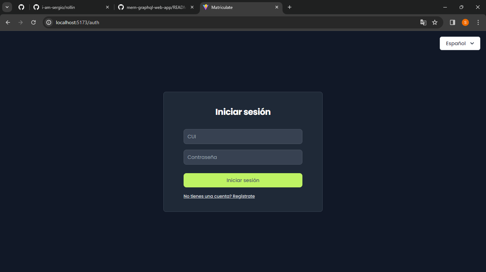
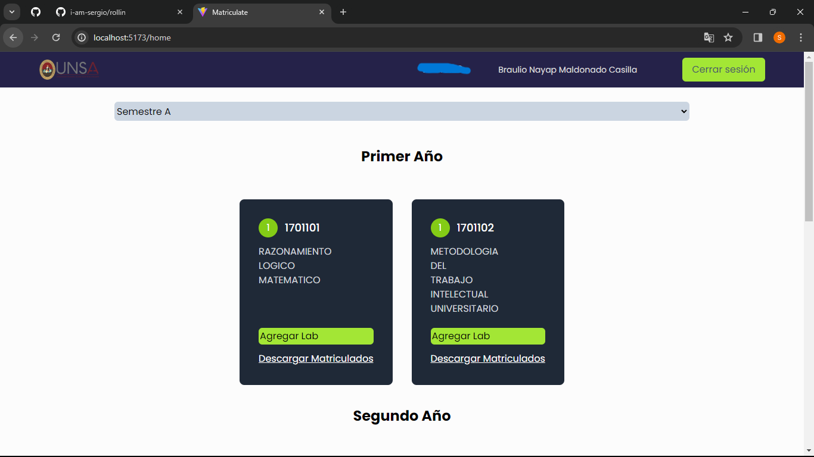
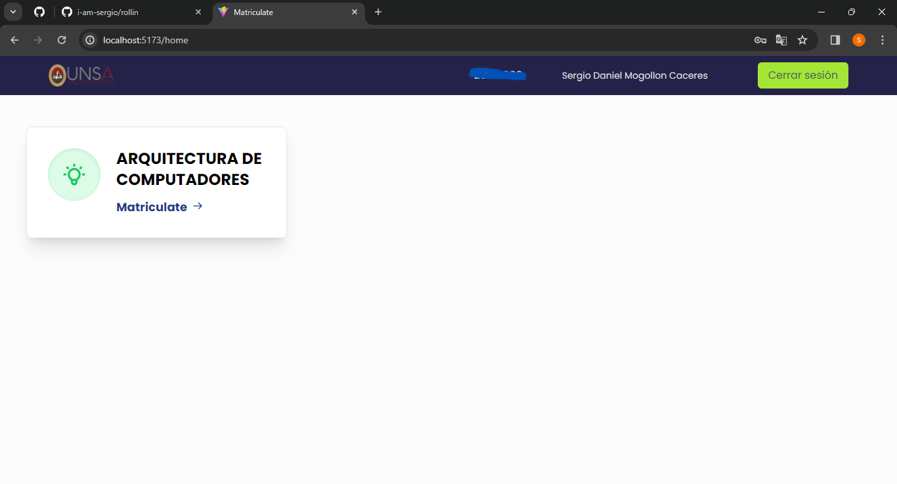
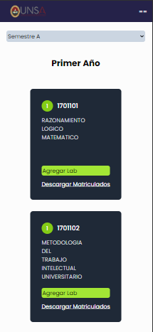

## Rollin Registration System

An online registration system for events, managing participant sign-ups on a first-come, first-served basis. Ideal for conferences, workshops, and courses with limited capacity, ensuring fair and efficient registration processes

### Technologies Used
This project has been developed using the following technologies:

- **Node.js**: For the backend server environment.
- **Express.js**: For handling HTTP requests and routing on the server.
- **MongoDB**: As the database management system for storing registration data.
- **React.js**: For building the user interface of the registration system.
- **TypeScript**: For adding static typing to JavaScript and enhancing code maintainability.
- **JWT (JSON Web Tokens)**: For user authentication and authorization.
- **bcrypt.js**: For hashing passwords and enhancing security.
- **Axios**: For making HTTP requests from the client-side to the server-side API.

### Features

1. **User Registration**: The system allows users to register by providing necessary details such as username, email, and password.
   
2. **User Authentication**: Registered users can log in securely using their credentials. JWT is used for token-based authentication.

3. **Password Hashing**: User passwords are securely hashed using bcrypt.js before storing them in the database, ensuring data security.

4. **Profile Management**: Users can manage their profiles, including updating personal information and changing passwords.

5. **Admin Dashboard**: An admin dashboard is available for authorized administrators to manage user registrations, view statistics, and perform administrative tasks.

6. **Email Verification**: Optionally, the system can include email verification functionality to verify the user's email address during registration.

7. **Responsive UI**: The user interface is developed using React.js, providing a responsive and user-friendly experience across different devices and screen sizes.

8. **API Integration**: Axios is used to communicate with the backend API, enabling seamless data exchange between the client and server.

These features collectively provide a comprehensive registration system that ensures secure user registration, authentication, and profile management for both users and administrators.

### Auth View

  

### Admin View

  

### User View

  

### Responsive View

  
  

